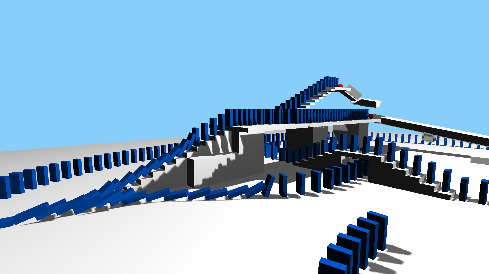
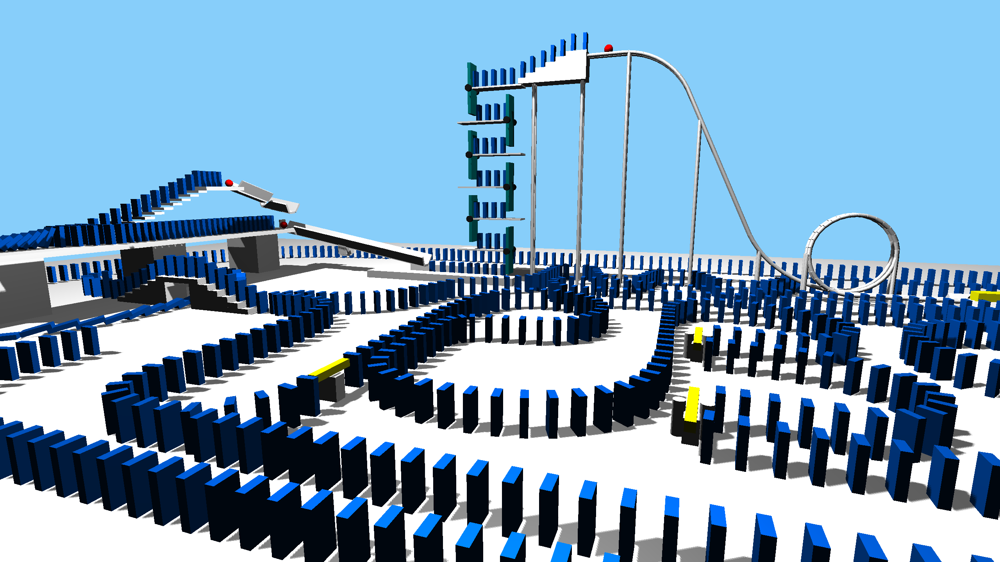
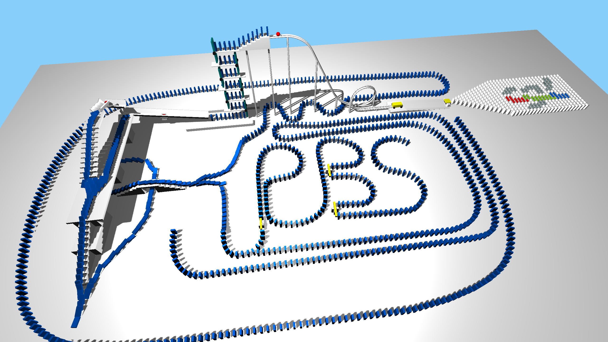
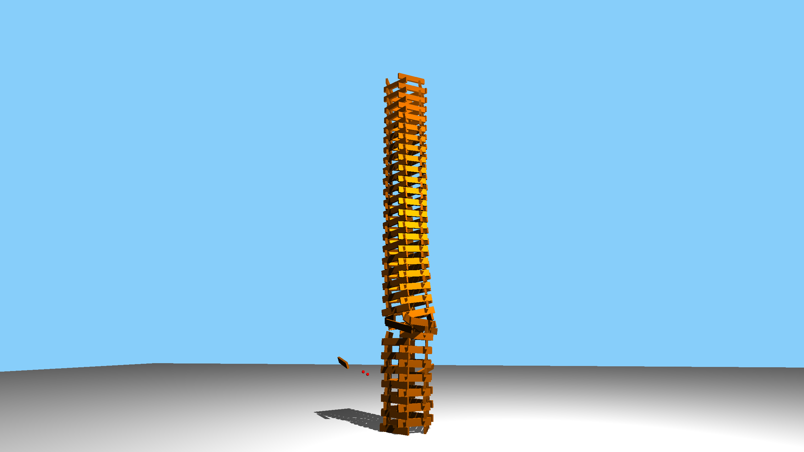
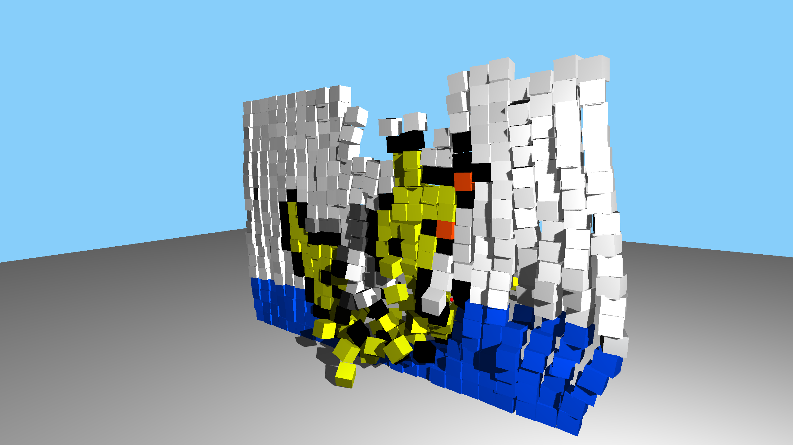

### About
A header only Constraint Based Rigid Body Physics Engine developed during the Physically Based Simulation lecture at ETH 2016 by 
Thomas Wolf, Thomas Etterlin and Stephan Zehnder.

### Demo
* [Video](https://youtu.be/_YkQuraMObo)
* [Android App](https://play.google.com/store/apps/details?id=com.lugalabs.phyiscsim)

[](http://www.youtube.com/watch?v=_YkQuraMObo)







### Features
* Hinge, distance, spring, balljoint constraints
* Inactivity Detector
* Leightweight: Only GLM and Eigen3 needed for the physics part
* Android (OpenGL ES) and Desktop (OpenGL) demos provided

### Compile
```
git submodule init
git submodule update
mkdir build
cd build
cmake ..
make -j8
```

### Run
```
./main
```

### Controls
* A / S / D / W for navigating
* 1 / 2 / ... to change scene
* b / n / m to change render modes
* space / q / e to shoot objects
* o to toggle debug mode
* p to pause & resume simulation
* esc to quit


